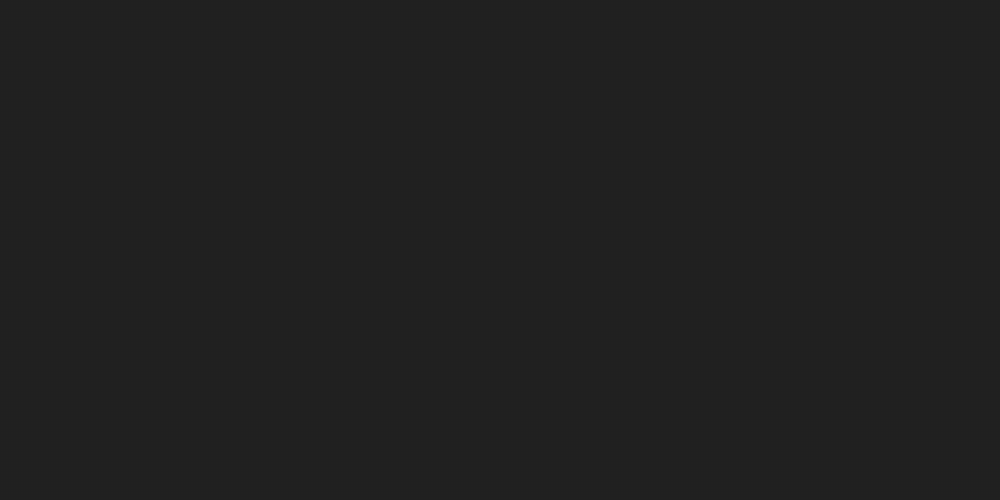

<h1 align="center">
  bpond
  <br>
  <sub>A procedural koi pond in your terminal</sub>
</h1>

<p align="center">
  <a href="https://crates.io/crates/bpond"></a>
  <a href="https://docs.rs/bpond"></a>
  <a href="https://github.com/miso-devel/bpond/blob/main/LICENSE"></a>
</p>

<p align="center">
  
</p>

---

A living pond in your terminal. Koi swim with chain-dynamics physics, lily pads drift on the surface, and frogs perch on the pads — breathing, croaking, leaping, and swimming when they end up in the water. Click to drop food, right-click to scare, press `r` for rain. No keyframes, no pre-baked frames. Everything is procedural and rendered into Unicode braille at sub-pixel resolution.

## Install

```bash
cargo install bpond
```

Requires Rust 1.80 or later. The installed binary lands in `~/.cargo/bin/`, so make sure that directory is on your `PATH`.

## Run

```bash
bpond                # standard mode
bpond --debug        # show a one-line header with current speed and key hints
```

Quit with `q` or `Esc`. The pond auto-sizes to the terminal — resize the window any time.

### From source

```bash
git clone https://github.com/miso-devel/bpond
cd bpond
cargo run --release
```

## Controls

| Input | Action |
|:---:|--------|
| Left click | Drop food |
| Right click | Scare nearby koi and frogs |
| `f` | Drop food at a random spot |
| `+` / `=` | Add a koi |
| `-` | Remove a koi |
| `r` | Toggle rain |
| `↑` / `↓` | Speed up / down |
| `q` / `Esc` | Quit |

## How It Works

**Spine**: 40 points chained at fixed distance. The head moves forward and the body follows; a head-to-tail traveling curvature wave gives each segment a subtle phase-delayed bend, producing the visible tail wagging during cruising and chasing.

**Rendering**: Each terminal cell = 2×4 braille sub-pixels (8× resolution). Body, fins, eyes, and tail are drawn as colored dots, with denser sampling across the body and a 3-band gradient so silhouettes anti-alias through canvas-level color averaging.

**Schooling**: A Boids-style rule (separation, alignment, cohesion) gently pulls idle koi into loose groups. When one koi heads for food, neighbors get curious and trail in — a "follow the leader" reaction familiar from real ponds.

**Feeding**: Koi detect food, steer with proportional navigation on a sharply tuned chase loop (high turn rate, lower forward speed), then decelerate, peck, and nibble with a small orbital wiggle.

**Fins**: Pectoral and pelvic fins each render as a 3-ray fan. While turning, the pectoral fin on the inside extends to brake; the outside fin tucks streamlined. Beat amplitude scales with the current thrust so sprinting and hovering look distinct.

**Frogs**: Pond frogs distinguish between resting on a pad and floating in water, and the simulation matches each.

* **On a pad** — dry posture (folded Z hind legs, visible front legs, throat-pulse breath). Off the sit timer, the frog rolls into a crouch-and-jump, an inflating vocal-sac croak, or a fast tongue flick.
* **In water** — submerged tint, hind legs trailing behind. The frog actively swims via short breaststroke kicks with a peak forward speed of ~8 wu/s; each kick begins with a random heading turn so the path curves like a real swimming frog instead of running straight. A frog in water *never* jumps somewhere random — it only leaps when there's a reachable pad to land on.

The lifecycle is one pipeline: crouch → jump → land. Landing on a pad routes to Sit; landing in open water routes to Float. Each frog tracks the pad it's perched on by index, so a drifting pad carries the frog with it (the perch detection can't go stale). Each frog also rolls one of three colour morphs (green, olive, brown) at spawn, blinks every few seconds, and reacts to right-clicks **and** to nearby food drops by immediately leaping away (koi happily go for the pellet; frogs scatter).

**Lily pads**: Each pad is a clean disc with a single V-shaped wedge cut from the rim — a random size and depth per pad. Pads drift on the water surface under spring-to-home physics plus per-pad ambient currents, a shared global wind, and the wake of koi and jumping frogs passing nearby. A pad with a perched frog on it tints toward water blue so the green frog reads clearly on top.

**Rain**: Pressing `r` toggles a rain shower. Drops spawn over the pond at a steady rate, each one painting a small wedge of motion before hitting the water and spawning a short-lived ripple. Toggle off and the existing drops clean themselves up.

**Effects**: Ripple rings expand from food drops, raindrops, frog landings, and from each swimming-frog kick (a small wake behind the body). Bubbles rise from the pond floor. Water color shifts through a slow day/night cycle, so the same pond at different times looks different.

## Architecture

```
src/
├── main.rs       Event loop + rendering (water background, header, key/mouse input)
├── canvas.rs     Braille sub-pixel canvas (each cell = 2×4 dots, 8× resolution)
├── pond.rs       Top-level simulation: owns koi / frogs / lilies / food / ripples
├── koi.rs        Koi struct + public API (spawn, snapshot, update entry, scare)
│   ├─ koi/physics.rs   Steering, body wave, Boids schooling, sub-step integration
│   └─ koi/draw.rs      Body / tail / fins / eyes — burst-scaled rendering
├── frog.rs       Frog state machine (Sit / Crouch / Jump / Land / Croak /
│                  TongueFlick / Float / SwimKick), spawn, FrogEvent
│   └─ frog/draw.rs     Body silhouette, legs (folded / extended / trailing /
│                       swimming), eyes, throat, vocal sac, tongue, submerged tint
├── lily.rs       Floating lily pads — V-wedge silhouette, drift physics,
│                  per-pad "occupied by a frog" tint
├── food.rs       Food pellet lifecycle (fade, eat-range)
├── ripple.rs     Expanding ring effects (food splash + raindrop + frog wake)
├── bubble.rs     Rising bubble particles
├── rain.rs       Rain system (drops + ripple spawning)
└── rng.rs        Shared deterministic pseudo-RNG
```

## Regenerating the demo

The gif at the top is captured from a real terminal session with [asciinema](https://docs.asciinema.org/) and rendered with [agg](https://github.com/asciinema/agg) — that path goes through the same braille glyphs your terminal already draws, so the result looks like the live app rather than a headless re-render.

```bash
brew install asciinema agg
cargo build --release

# 1) Record. Resize your terminal first; the recording captures
#    the size at the moment of `asciinema rec`.
asciinema rec --overwrite -i 0.5 assets/demo.cast
./target/release/bpond
# … exercise the pond (f, r, +, q) then quit; exit the shell.

# 2) Render to a raw gif, then crop + scale to 1200×600 (the size
#    the README's  expects) and quantise the palette so the
#    file stays under ~10 MB.
agg --font-size 18 assets/demo.cast /tmp/demo-raw.gif
ffmpeg -y -i /tmp/demo-raw.gif \
  -vf "fps=12,scale=1200:-1:flags=lanczos,crop=1200:600:0:(in_h-600)/2,palettegen=max_colors=96" \
  /tmp/palette.png
ffmpeg -y -i /tmp/demo-raw.gif -i /tmp/palette.png \
  -lavfi "fps=12,scale=1200:-1:flags=lanczos,crop=1200:600:0:(in_h-600)/2 [x]; [x][1:v] paletteuse=dither=bayer:bayer_scale=4" \
  assets/demo.gif
```

`assets/*.cast` is gitignored — re-record any time the simulation changes.

## License

MIT
